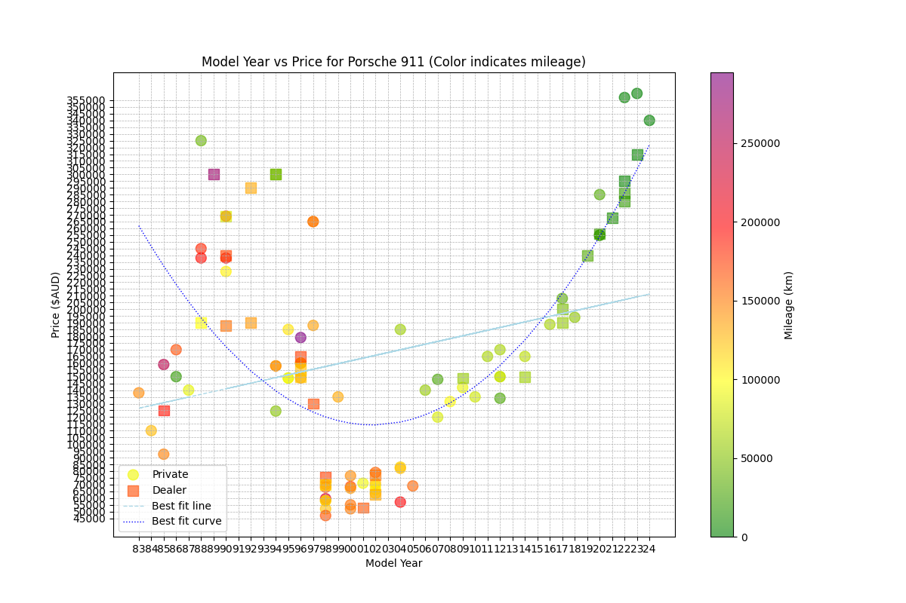
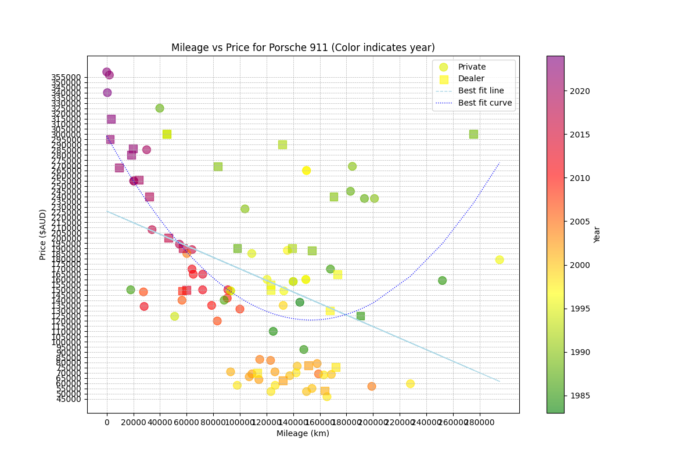

# Car Price Plotter 

Buying used cars is hard, especially knowing what a good market price for a used car is. The prices are mainly dependent on the year of the car and the mileage.

This car price plotter takes your raw data that you collect eg. from carsales.com.au and plots it in a nice graph. 
It shows a best fit line (less accurate) and a best fit curve (more accurate). Given that info you can now instantly tell if a used car is good value based on the price, year, and mileage, in comparison to the current market.

You can generate scatter plots that show the relationship between 
- car price and model year; the mileage is visualised as the 3rd dimension using differnt colours
- car price vs mileage; the model year is visualised as the 3rd dimension using different colours

## Features

- List all `.xlsx` files in the current directory.
- Generate scatter plots for:
  - Price vs. Year with mileage as the color. In the example below you can see that prices of Porsche 911s follow a u-shape when analysed by year. The price drops until about 2001, after which Porsche 911s actually appreciate in value. Interestingly you can also see that the years 1998-2005 were particularly bad models when it comes to price. That's the universally hated 996 version of the Porsche. If you find a 1995 model for under $140000 then you got yourself ad deal!

  - Price vs. Mileage with year as the color. This graph shows the prices vs mileage. Notice there is a huge $40000 price drop between 80k and 100k kms! Again the orange 996 model years form 1996 to 2005 are in the low price range. 

- View best fit line and best fit curve
- Distinguish between Dealer and Private cars via the icon.

## Installation

1. **Clone the repository**:
    ```bash
    git clone https://github.com/CookieRebel/car-price-plotter.git
    cd car-price-plotter
    ```

2. **Install the required Python packages**:
    ```bash
    pip install -r requirements.txt
    ```

## Usage

1. **Ensure your car price data is in an Excel file (`.xlsx` format) in the current directory**. The filename should follow the format: `car_name_year.xlsx`, for example, `mini_s_convertible_2015+.xlsx`.

2. **Run the script**:
    ```bash
    python plot_graph.py
    ```

3. **Follow the prompts**:
    - Select the Excel file you want to analyze by entering the corresponding number.
    - The script will prefill the car name based on the filename. You can either accept the suggested name or enter a new one.
    - Choose the type of graph you want to generate:
      - Enter `1` for a Price vs. Year graph.
      - Enter `2` for a Price vs. Mileage graph.

4. **View and save the plots**:
    - The generated plot will be displayed. You can save the plot using the save icon in the plot window. The suggested filename, including the date, will be set automatically.

## Excel File Format

The Excel file should have the following columns:

- **Year**: The model year of the car.
- **Model**: The make and model of the car.
- **Variant**: The variant of the car model.
- **Description**: A description of the car.
- **Price ($AUD)**: The price of the car in Australian dollars.
- **Mileage (km)**: The mileage of the car in kilometers.
- **Seller Type**: The type of seller (e.g., Private, Dealer).
- **Location**: The location of the seller.
- **Source**: The source where the car listing was found.
- **Comment**: Additional comments about the car.
- **Comment 2**: Additional comments about the car (second comment field).

### Example Row

| Year | Model       | Variant  | Description                   | Price ($AUD) | Mileage (km) | Seller Type | Location | Source  | Comment | Comment 2 |
|------|-------------|----------|-------------------------------|--------------|--------------|-------------|----------|---------|---------|-----------|
| 1995 | Porsche 911 | 993      | Carrera Manual R              | 148998       | 93000        | Private     | NaN      | Carsales| NaN     | NaN       |

## Requirements

- Python 3.x
- pandas
- matplotlib
- numpy
- openpyxl

## License

This project is licensed under the MIT License.

